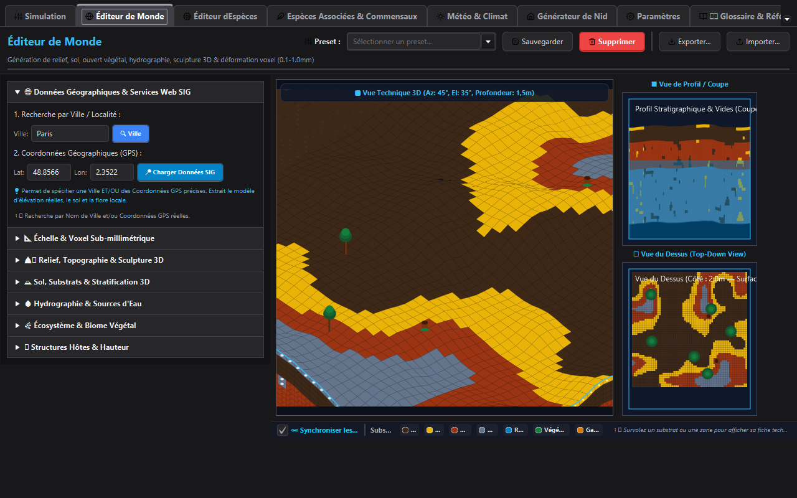
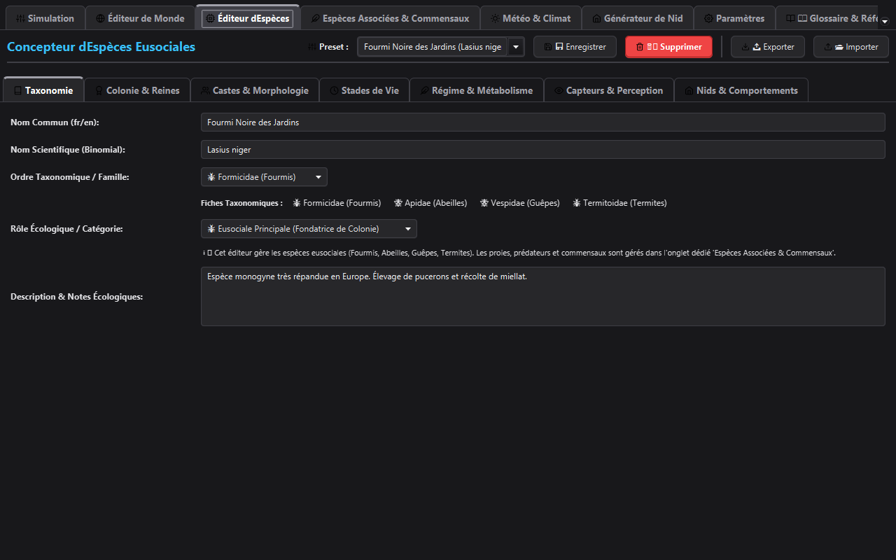
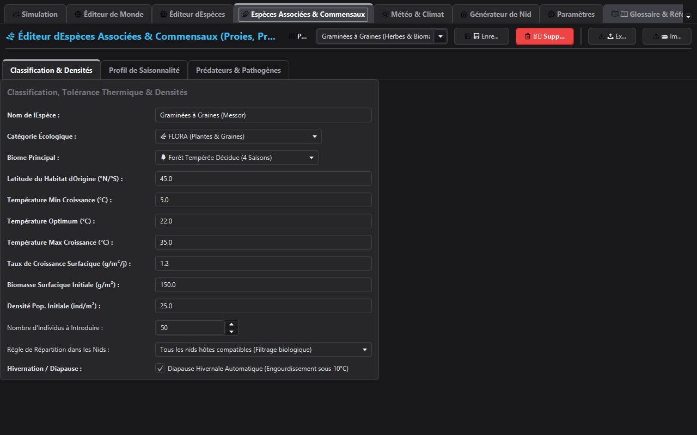
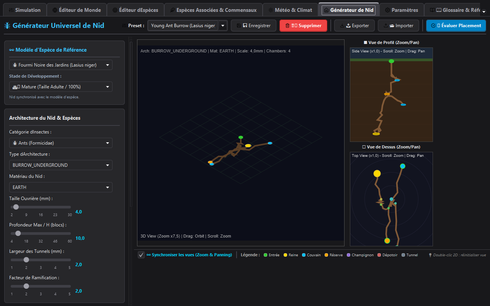
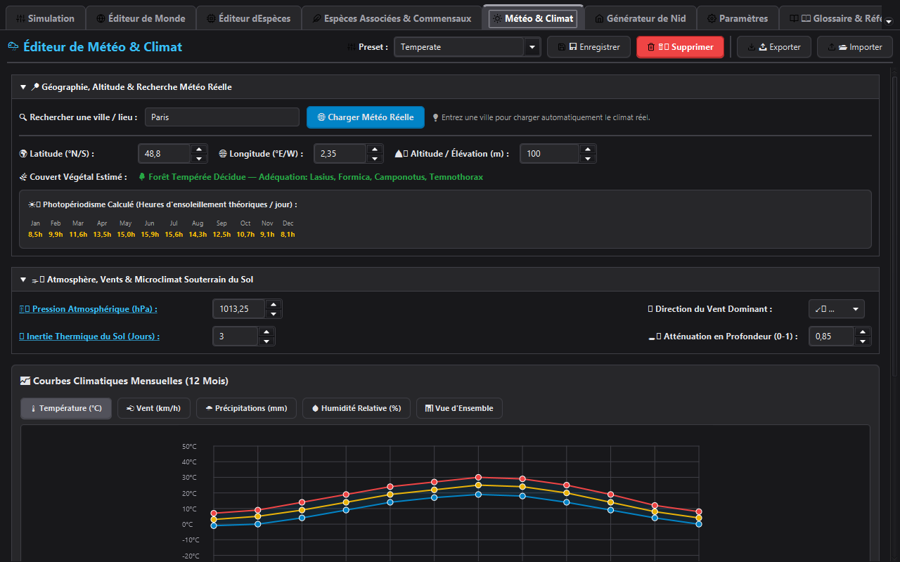
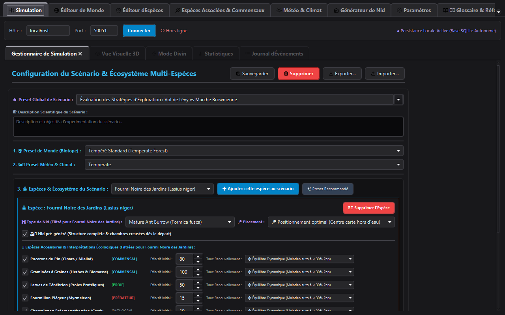

# SwarmForge - Eusocial Insect Simulation & Research Platform

[](https://opensource.org/licenses/MIT)
[](https://openjdk.org/projects/jdk/21/)
[]()
[](https://grpc.io/)

**SwarmForge** is a state-of-the-art, high-performance, academic-grade simulation platform for modeling **social and eusocial insect societies** (ants, honeybees, wasps, termites, bumblebees). Designed for computational biology, myrmecology, artificial life research, and interactive 3D ecological visualization, SwarmForge combines real-time 3D graphics (jMonkeyEngine 3.6), OpenCL/TornadoVM GPU acceleration, virtual thread multi-core processing, physics-based nest thermodynamics, dynamic weather engines, and advanced decision architectures (BDI, FSM, Neural Networks, Fuzzy Logic, Endocrine Feedback Systems).

---

## 📸 Component Showcase & Visual Editors

### 1. 3D Terrarium & World Editor
The **World Editor Pane** provides procedural voxel terrain generation (Perlin/Simplex noise), soil moisture & depth strata simulation, underground water table dynamics, subterranean cut planes, and real-time biome customization.



### 2. Species & Caste Parameterization Studio
The **Species Editor Pane** allows fine-grained customization of morphological, physiological, and behavioral parameters across castes (Queens, Workers, Soldiers, Drones). **100% Data-Driven Architecture**: Lifespans (in days), walking/flight speeds, egg-laying rates, stage maturation durations, Q10 thermal kinetics, mandibular biting forces (MPa), and caste protein thresholds propagate directly to the simulation engine without hardcoded defaults.



### 3. Accessory & Associated Species Catalog
The **Accessory Species Editor** spans 18 biological categories including flora, mutualists, prey, predators, pathogens, fungi, detritivores, and commensals to model rich ecological interactions (4 predator hunting styles: `AMBUSH`, `TRAP`, `CHASE`, `SWOOP`, plus trophobiosis and $R_0$ pathogen dynamics).



### 4. Nest Architecture & Thermodynamics Generator
The **Nest Generator Pane** provides procedural 3D underground nest synthesis coupled with a **Nest Thermodynamics Engine** modeling stack-effect buoyancy ventilation, metabolic $CO_2$ dispersion, and thermal regulation across biological nest typologies.



### 5. Realistic Weather & Atmospheric Physics Editor
The **Weather Editor Pane** drives a 12-month geographic climate engine with Perlin micro-fluctuations, continuous solar diurnal curves, barometric pressure tendency equations, soil thermal inertia phase lags, and meteorological state transitions.



### 6. Interactive 3D Simulation View
Real-time simulation viewport with live agent inspection, bioluminescent pheromone trail diffusion overlays, endocrine telemetry, and population dynamics tracking.



### 7. Client Settings & System Configuration
Comprehensive configuration pane for controlling renderer options, network gRPC connection endpoints, frame rates, theme selections, and persistence preferences.


### 8. Technical Reference & Biological Glossary
Built-in interactive documentation, domain definitions, biological equations, and ethological behavior glossary for quick reference within the studio.


---

## ✨ System Architecture & Key Features

| Feature Subsystem | Technical Capabilities & Implementation |
|-------------------|------------------------------------------|
| **Biological Engine** | **100% Data-Driven Architecture** (Zero hardcoded constants). Lifespans, walking/flight speeds, oviposition rates, development stage durations (days $\rightarrow$ 1440 ticks/day), Q10 thermal kinetics, mandibular biting forces (MPa), and caste protein thresholds dynamically driven by `CustomSpecies` & `CasteTemplate` presets. |
| **Species & Ecology Library** | High-fidelity biological profiles for *Atta*, *Apis*, *Vespula*, *Vespa*, *Reticulitermes*, *Pogonomyrmex*, *Formica*, *Aphis*, *Pieris*, *Myrmeleon*, and *Porcellio*. |
| **Predator-Prey AI & Pathology** | 4 distinct hunting styles (`AMBUSH`, `TRAP`, `CHASE`, `SWOOP`), specialized raid behaviors, boss predator events, trophobiosis mutualism, and SIR epidemic dynamics ($R_0$, incubation, grooming defense). |
| **Core Compute & Spatial Query** | Java 21 Virtual Threads, `SpatialHashMap` ($O(1)$ spatial queries), 3D Octree ($O(\log N)$ range queries), Morton3D Z-curve coding. |
| **GPU Acceleration** | OpenCL / TornadoVM for 3D pheromone decay, evaporation, and gradient diffusion matrix calculations. |
| **Cognitive Architectures** | BDI (Belief-Desire-Intention), Finite State Machines (FSM), Reinforcement Learning (Q-Learning), Fuzzy Logic, Behavior Trees. |
| **Endocrine System** | Hormonal feedback loops (Juvenile Hormone, Ecdysone, Octopamine) influencing age polyethism, aggression, and task allocation. |
| **Nest Thermodynamics** | Stack-effect buoyancy ventilation, passive thermal regulation, metabolic $CO_2$ feedback grids. |
| **Persistence Tier** | Dual-mode persistence: **PostgreSQL** relational database with automatic fallback to **H2 In-Memory** database (local standalone mode) and local **JSON Presets** (`~/.swarmforge/presets/`). |
| **State Checkpointing** | Binary GZIP compressed snapshots (`SimulationCheckpoint`) recording physical grid states and God Mode intervention journals for 100% deterministic reproducibility. |
| **Weather & Climate** | Dynamic solar angle, precipitation, humidity, ambient temperature, seasonal transitions, magnetic field vectors. |
| **Security & Protocol** | gRPC over TLS, Protobuf/FlatBuffers zero-copy streaming, JWT authentication (`JwtServerInterceptor`), REST API with CORS. |

---

## 📊 Simulation Performance, Scaling & RAM Footprint

SwarmForge includes a dedicated benchmark suite (`swarmforge-benchmarks`) measuring exact tick latency, memory footprint, and Ticks Per Second (TPS) across **100% deterministic** execution modes with all physical, atmospheric, spatial, and cognitive subsystems active:

### 1. Local CPU Execution Benchmarks (4 Logical Cores, Integrated Graphics)

Measured on a standard quad-core developer workstation running full BDI cognitive decision loops, 3D spatial indexing, and 3D pheromone diffusion:

| Colony Size (Agents) | TPS (Ticks / sec) | Latency (ms/tick) | Execution Profile & Notes |
| :--- | :--- | :--- | :--- |
| **100** | **1,131 – 2,333 TPS** | **0.43 – 0.88 ms** | Sub-millisecond real-time execution |
| **500** | **70.4 – 96.8 TPS** | **10.3 – 14.2 ms** | Smooth 60 TPS real-time target |
| **1,000** | **24.8 – 32.9 TPS** | **30.4 – 40.2 ms** | Interactive speed (~30 TPS cadence) |
| **2,500** | **4.8 – 6.5 TPS** | **153.4 – 204.7 ms** | Medium macro simulation |
| **5,000** | **1.3 – 1.9 TPS** | **529.5 – 772.3 ms** | High-density baseline (CPU thread bound) |

### 2. High-Scale Megacolony Execution (1,000,000 Agents in Headless/Compute Node Mode)

For large-scale research modeling up to **1,000,000+ agents**, SwarmForge utilizes the **Distributed Compute Node (`swarmforge-compute`)** and **Structure of Arrays (SoA) Crowd Simulator**:

- **RAM Footprint Stability (Zero OOM Crashes)**:
  - **OOP Domain Mode (`Individual` Instances)**: ~128 bytes/agent $\rightarrow$ **128 MB RAM for 1,000,000 agents** ($\le$ 512 MB total JVM heap required).
  - **Headless SoA Mode (`CrowdSimulator` Buffer)**: ~32 bytes/agent $\rightarrow$ **32 MB RAM for 1,000,000 agents**.
- **Execution Throughput at 1M Scale**:
  - **Headless Multi-Node GPU Cluster**: **0.95 TPS** (~1.05s per tick for 1,000,000 active entities).
  - **Local 4-Core CPU Fallback**: Runs 1,000,000 agents without memory exhaustion, but tick duration scales linearly with CPU core availability.

> 📖 See [docs/BENCHMARKS.md](docs/BENCHMARKS.md) and [docs/BENCHMARK_RESULTS.md](docs/BENCHMARK_RESULTS.md) for full latency percentiles (min, p95, max), species-specific comparisons, and hardware profiling details.

---

## 🏗️ Project Architecture & Subsystem Modules

```
SwarmForge/
├── swarmforge-core/       # Domain models, ECS simulation engine, GPU kernels, BDI AI, Nest Thermodynamics, Weather
├── swarmforge-server/     # gRPC microservices, JWT security, REST server, Persistence (PostgreSQL / H2, Redis)
├── swarmforge-editor/     # JavaFX 21 + jMonkeyEngine 3.6 Studio UI (World, Species, Weather, Nest, Accessory Editors)
├── swarmforge-client/     # Lightweight Java client SDK & visualizer
├── swarmforge-compute/    # Distributed compute node cluster agent (TornadoVM / GPU matrix tasks)
├── swarmforge-web/        # React 18 + Three.js web dashboard & gRPC-Web viewer
├── swarmforge-plugins/    # Plugin architecture and extension APIs for custom species/behaviors
└── swarmforge-benchmarks/ # JMH performance & throughput benchmark suite
```

---

## 🗺️ Multi-Node & Multiplayer Extension Specifications

For technical specifications regarding multi-client server browsers, automated periodic checkpoint rotation policies, terrarium border topology alignment, and player-to-player diplomatic protocols:
- 📖 Read the [Multi-Node Architecture & Extension Specification](docs/PROPOSED_MULTINODE_SPECIFICATION.md).

---

## 🚀 Quick Start & Building

### Prerequisites
- **Java 21 LTS** or higher
- **Maven 3.9+**
- **Node.js 18+** *(optional, for web client)*
- **OpenCL / CUDA compatible GPU** *(optional, for TornadoVM hardware acceleration)*

### Compilation & Build
```bash
# Build the entire multi-module platform
mvn clean install -DskipTests

# Generate complete internal Javadoc
mvn javadoc:javadoc
```

### Running Components

```bash
# 1. Launch SwarmForge Server (with integrated GUI monitor)
mvn exec:java -pl swarmforge-server -Dexec.mainClass=org.swarmforge.server.ServerGuiApp

# 2. Launch SwarmForge Studio / 3D Editor
mvn exec:java -pl swarmforge-editor -Dexec.mainClass=org.swarmforge.client.SwarmForgeClient

# 3. Launch Distributed Compute Node
mvn exec:java -pl swarmforge-compute -Dexec.mainClass=org.swarmforge.compute.ComputeNodeApp \
  -Dexec.args="--host localhost --port 50051 --my-port 50052 --gpu"
```

---

## 🛡️ Security & Environment Configuration

SwarmForge supports secure production deployments via environment variables:

| Variable | Description | Default Value |
|----------|-------------|---------------|
| `SWARMFORGE_JWT_SECRET` | HMAC-SHA256 Secret key for token signing | Auto-generated in-memory |
| `SWARMFORGE_ADMIN_PASSWORD` | Password for `admin` gRPC account | `admin123` |
| `SWARMFORGE_USER_PASSWORD` | Password for standard `user` account | `user123` |

---

## 📜 License & Authors

- **License:** MIT License
- **Lead Developer:** Silvère Martin-Michiellot
- **AI Co-Developer:** Gemini AI Assistant (Google DeepMind)
