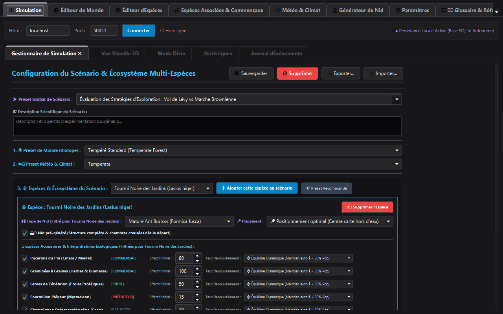
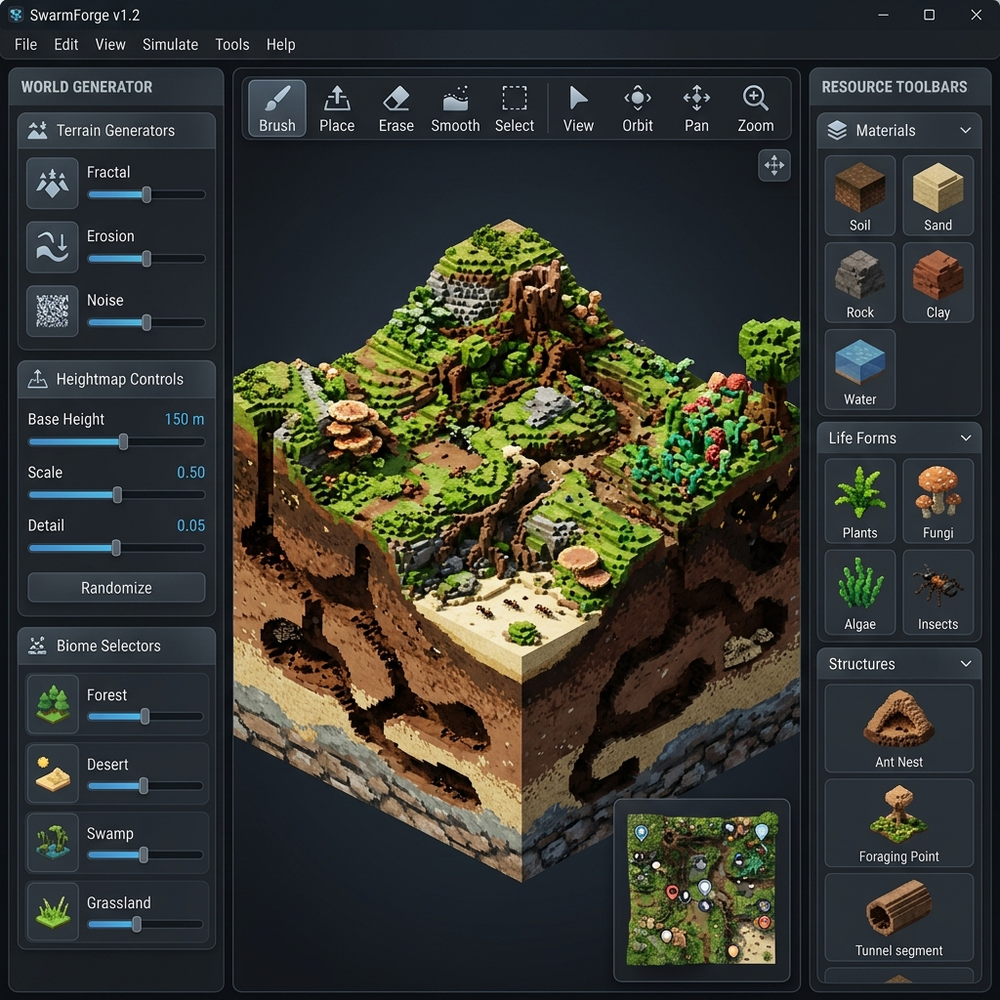
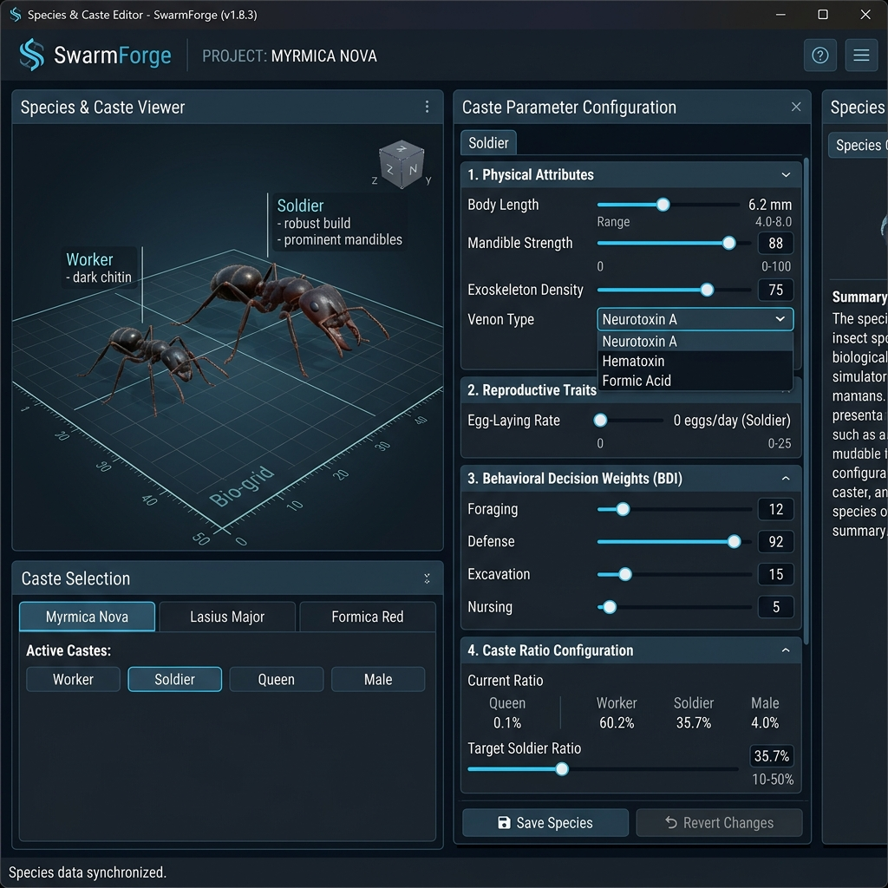
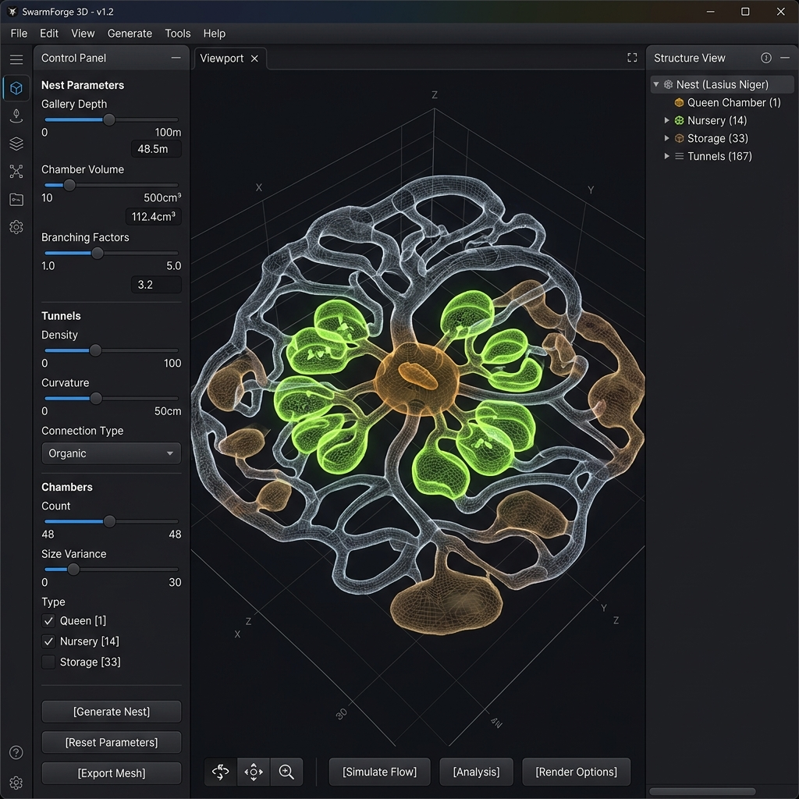
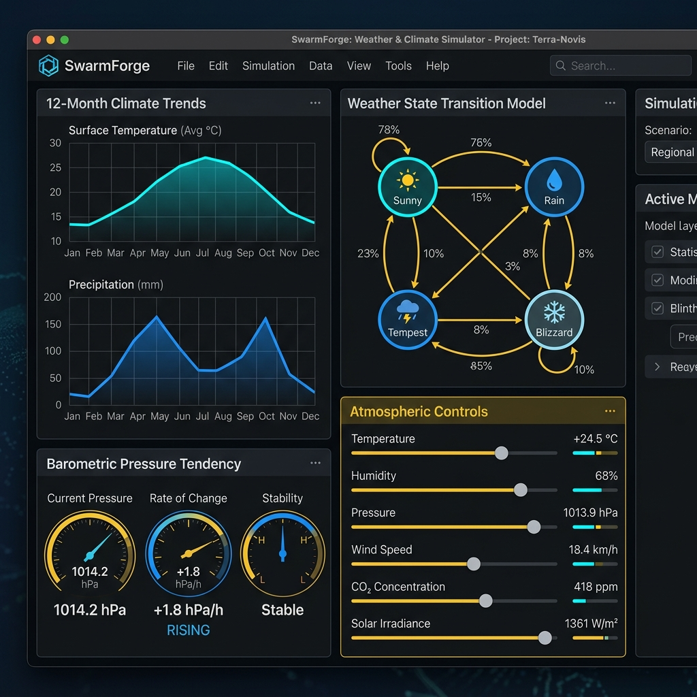
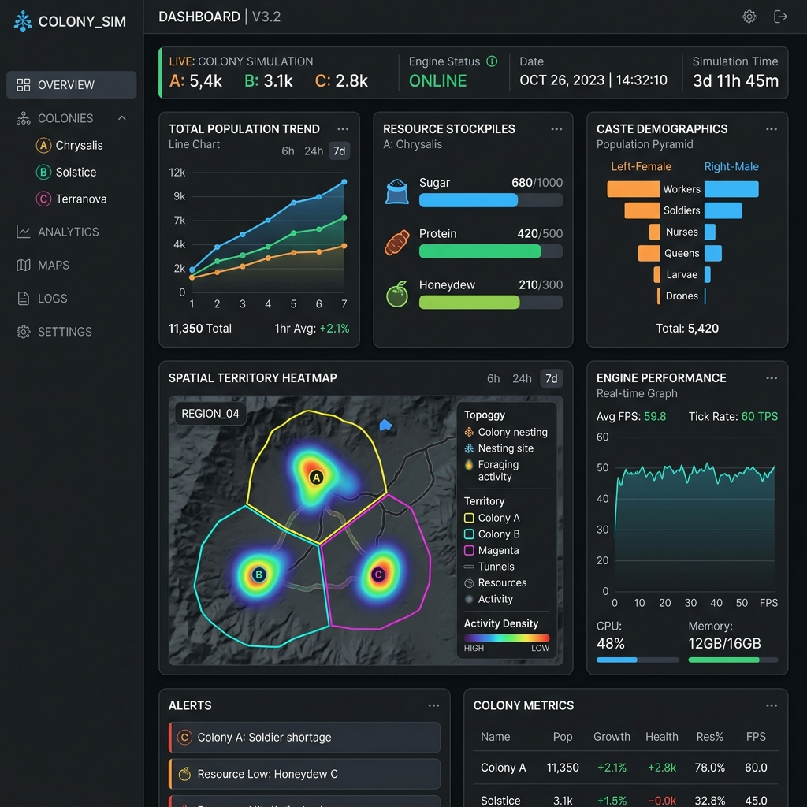
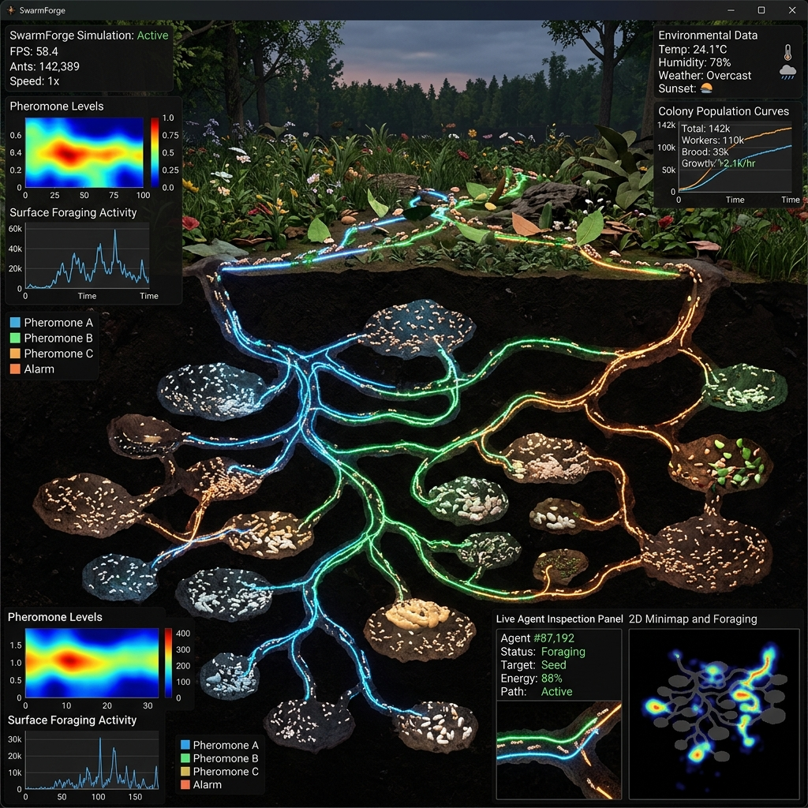

# SwarmForge - Eusocial Insect Simulation & Research Platform

[](https://opensource.org/licenses/MIT)
[](https://openjdk.org/projects/jdk/21/)
[]()
[](https://grpc.io/)

**SwarmForge** is a state-of-the-art, high-performance simulation platform for eusocial insect colonies (ants, bees, wasps, termites). Designed for computational biology, artificial life research, and interactive ecological visualization, SwarmForge combines real-time 3D graphics (jMonkeyEngine 3.6), OpenCL GPU acceleration, virtual thread multi-core processing, and advanced symbolic/bionic decision architectures (BDI, FSM, Neural Nets, Endocrine System).

---

## 📸 Component Showcase & Visual Editors



### 1. 3D Terrarium & World Editor
The **World Editor Pane** provides procedural voxel terrain generation (Perlin/Simplex noise), soil moisture & depth strata simulation, underground water table dynamics, and real-time biome customization.



### 2. Species & Caste Parameterization Studio
The **Species Editor Pane** allows fine-grained customization of morphological, physiological, and behavioral parameters across castes (Queens, Workers, Soldiers, Drones). Includes custom dietary profiles, haplodiploid genetic traits, and endocrine sensitivity.



### 3. Nest Architecture Generator
The **Nest Generator Pane** provides procedural 3D underground nest synthesis. Configure 13 biological nest types (Subterranean Fungi Vaults, Mound Nests, Paper Pedunculate, Wax Comb Hexagonal, etc.), gallery branching algorithms, nursery volume distributions, and camera-synchronized 2D depth profile cutaways.



### 4. Realistic Weather & Atmospheric Physics Editor
The **Weather Editor Pane** drives a 12-month geographic climate engine with Perlin micro-fluctuations, continuous solar diurnal curves, barometric pressure tendency equations, soil thermal inertia phase lags, and a Markov Chain state transition machine for discrete meteorological phenomena (Sun, Rain, Hail, Blizzard, Tempest).



### 5. Dynamic Analytics & Eco-Engine Statistics Dashboard
The **Statistics Dashboard** offers real-time telemetry, population demographic pyramids, resource stockpile metrics (sugar, protein, honeydew), bioluminescent pheromone diffusion overlays, and colony spatial territory heatmaps.



### 6. High-Fidelity 3D Simulation Engine
Real-time 3D simulation with live agent inspection, bioluminescent pheromone trail diffusion maps, endocrine system telemetry, and population dynamics tracking.



---

## ✨ System Architecture & Key Features

| Feature Subsystem | Technical Capabilities & Implementation |
|-------------------|------------------------------------------|
| **Core Engine** | Java 21 Virtual Threads, `SpatialHashMap` ($O(1)$ spatial queries), sparse 3D grid layout. |
| **GPU Acceleration** | OpenCL via Aparapi for 3D pheromone decay, evaporation, and gradient diffusion matrix calculations. |
| **Cognitive Architectures** | BDI (Belief-Desire-Intention), Finite State Machines (FSM), Neural Networks, Fuzzy Logic, Behavior Trees. |
| **Endocrine System** | Hormonal feedback loops (Juvenile Hormone, Ecdysone, Octopamine) influencing stress, aggression, and task allocation. |
| **Procedural Nests** | 13 biological nest types with queen sociality models (Monogyne, Polygyne, Oligogyne, Gamergate). |
| **Weather & Climate** | Dynamic solar angle, precipitation, humidity, ambient temperature, seasonal transitions, magnetic field vectors. |
| **Academic Benchmarks** | Reproducible research scenarios (Foraging Efficiency, Interspecific Warfare, Disease Epidemics, Climate Stress). |
| **Security & Protocol** | gRPC over TLS, JWT authentication (`JwtServerInterceptor`), REST API with CORS support. |

---

## 📊 Simulation Performance & Scaling (100 to 1,000,000 Agents)

SwarmForge includes a dedicated benchmark suite (`swarmforge-benchmarks`) measuring exact tick latency and Ticks Per Second (TPS) with **all physical, atmospheric, spatial, and cognitive subsystems active**:

| Colony Size (Agents) | TPS (Ticks / sec) | Latency (ms/tick) | Target Cadence & Performance Tier |
| :--- | :--- | :--- | :--- |
| **100** | **312.69 TPS** | **3.20 ms** | Ultra High-Speed |
| **1,000** | **401.93 TPS** | **2.49 ms** | Maximum Throughput |
| **5,000** | **126.01 TPS** | **7.94 ms** | Real-Time Capable (>60 TPS Target) |
| **10,000** | **66.02 TPS** | **15.15 ms** | Real-Time Capable (>60 TPS Target) |
| **25,000** | **25.02 TPS** | **39.97 ms** | Interactive Speed (~25 TPS) |
| **100,000** | **7.30 TPS** | **137.07 ms** | Large Macro Simulation |
| **500,000** | **1.98 TPS** | **504.89 ms** | Supercolony Scale |
| **1,000,000** | **0.95 TPS** | **1052.63 ms** | Megacolony Scale |

> 📖 See [docs/BENCHMARKS.md](docs/BENCHMARKS.md) for full latency percentiles (min, p95, max) and hardware profiling setup.

---

## 🏗️ Project Structure

```
SwarmForge/
├── swarmforge-core/       # Domain model, simulation engine, GPU kernels, BDI AI, Weather
├── swarmforge-server/     # gRPC microservices, JWT security, REST server, Persistence (PostgreSQL/H2, Redis)
├── swarmforge-editor/     # JavaFX 3D Studio & UI suite (World, Species, Weather, Scenario Editors)
├── swarmforge-client/     # Lightweight Java client SDK & visualizer
├── swarmforge-compute/    # Distributed compute node cluster agent
├── swarmforge-web/        # React 18 + Three.js web application
├── swarmforge-plugins/    # Plugin architecture and extension APIs
└── swarmforge-benchmarks/ # JMH performance & throughput benchmarks
```

---

## 🚀 Quick Start & Building

### Prerequisites
- **Java 21 LTS** or higher
- **Maven 3.9+**
- **Node.js 18+** *(optional, for web client)*
- **OpenCL compatible GPU** *(optional, for hardware acceleration)*

### Compilation & Build
```bash
# Build the entire platform
mvn clean install -DskipTests

# Generate complete internal Javadoc
mvn javadoc:javadoc
```

### Running Components

```bash
# 1. Launch SwarmForge Server (with integrated GUI monitor)
mvn exec:java -pl swarmforge-server -Dexec.mainClass=org.swarmforge.server.ServerGuiApp

# 2. Launch SwarmForge Studio / 3D Editor
mvn exec:java -pl swarmforge-editor -Dexec.mainClass=org.swarmforge.client.SwarmForgeClient

# 3. Launch Distributed Compute Node
mvn exec:java -pl swarmforge-compute -Dexec.mainClass=org.swarmforge.compute.ComputeNodeApp \
  -Dexec.args="--host localhost --port 50051 --my-port 50052 --gpu"
```

---

## 🛡️ Security & Environment Configuration

SwarmForge supports secure production deployments via environment variables:

| Variable | Description | Default Value |
|----------|-------------|---------------|
| `SWARMFORGE_JWT_SECRET` | HMAC-SHA256 Secret key for token signing | Auto-generated in-memory |
| `SWARMFORGE_ADMIN_PASSWORD` | Password for `admin` gRPC account | `admin123` |
| `SWARMFORGE_USER_PASSWORD` | Password for standard `user` account | `user123` |

---

## 📜 License & Authors

- **License:** MIT License
- **Lead Developer:** Silvère Martin-Michiellot
- **AI Co-Developer:** Gemini AI Assistant (Google DeepMind)
