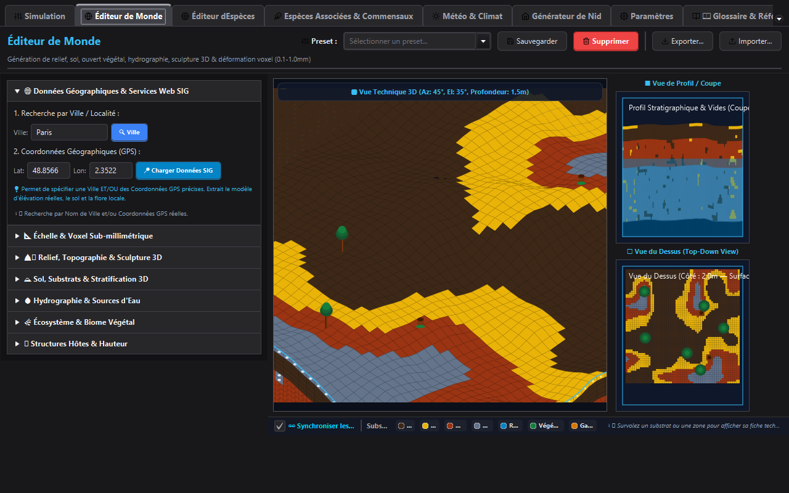
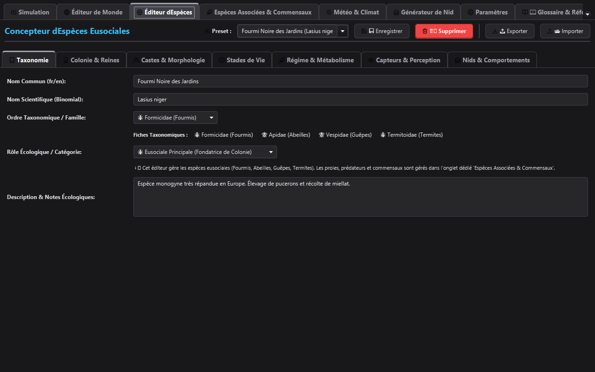
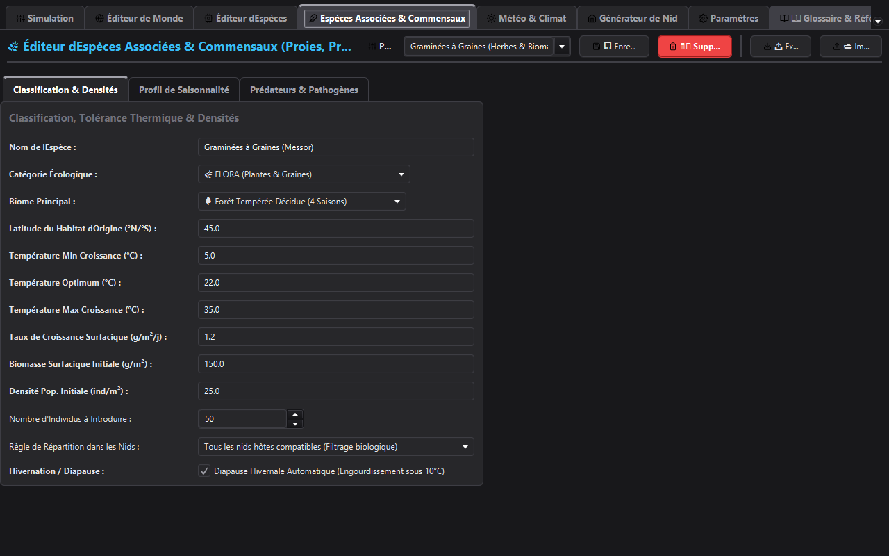
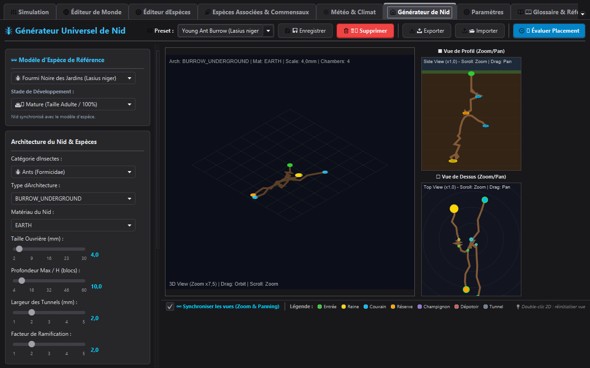
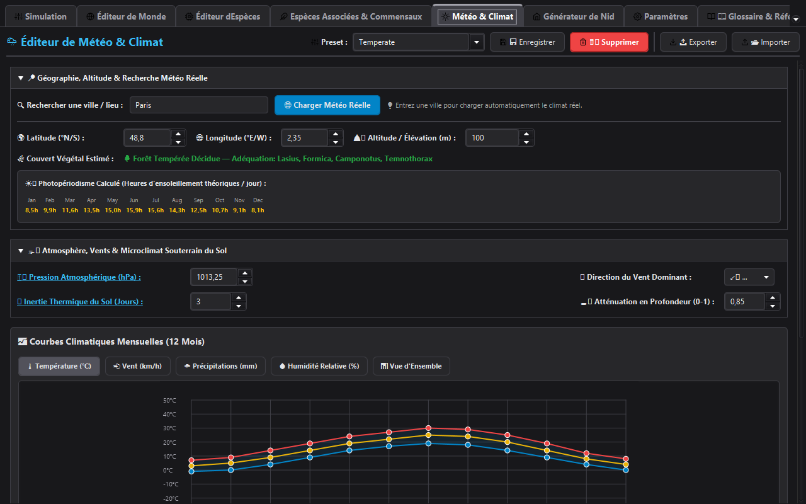
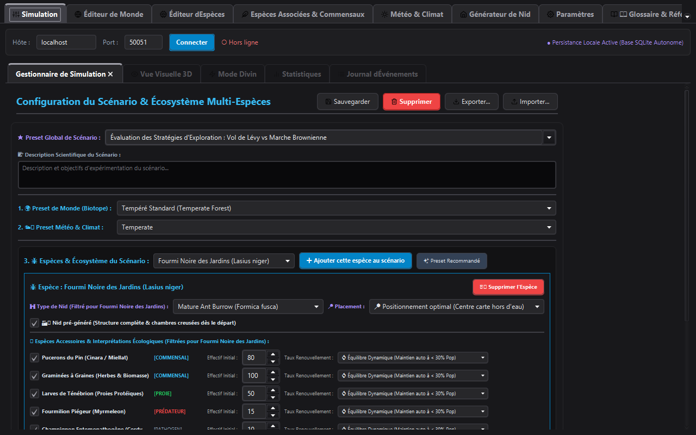

# SwarmForge - Eusocial Insect Simulation & Research Platform

[](https://opensource.org/licenses/MIT)
[](https://openjdk.org/projects/jdk/21/)
[]()
[](https://grpc.io/)

**SwarmForge** is a state-of-the-art, high-performance, academic-grade simulation platform for modeling **social and eusocial insect societies** (ants, honeybees, wasps, termites, bumblebees). Designed for computational biology, myrmecology, artificial life research, and interactive 3D ecological visualization, SwarmForge combines real-time 3D graphics (jMonkeyEngine 3.6), OpenCL/TornadoVM GPU acceleration, virtual thread multi-core processing, physics-based nest thermodynamics, dynamic weather engines, and advanced decision architectures (BDI, FSM, Neural Networks, Fuzzy Logic, Endocrine Feedback Systems).

---

## 📸 Component Showcase & Visual Editors

### 1. 3D Terrarium & World Editor
The **World Editor Pane** provides procedural voxel terrain generation (Perlin/Simplex noise), soil moisture & depth strata simulation, underground water table dynamics, subterranean cut planes, and real-time biome customization.



### 2. Species & Caste Parameterization Studio
The **Species Editor Pane** allows fine-grained customization of morphological, physiological, and behavioral parameters across castes (Queens, Workers, Soldiers, Drones). **100% Data-Driven Architecture**: Lifespans (in days), walking/flight speeds, egg-laying rates, stage maturation durations, Q10 thermal kinetics, mandibular biting forces (MPa), and caste protein thresholds propagate directly to the simulation engine without hardcoded defaults.



### 3. Accessory & Associated Species Catalog
The **Accessory Species Editor** spans 18 biological categories including flora, mutualists, prey, predators, pathogens, fungi, detritivores, and commensals to model rich ecological interactions (4 predator hunting styles: `AMBUSH`, `TRAP`, `CHASE`, `SWOOP`, plus trophobiosis and $R_0$ pathogen dynamics).



### 4. Nest Architecture & Thermodynamics Generator
The **Nest Generator Pane** provides procedural 3D underground nest synthesis coupled with a **Nest Thermodynamics Engine** modeling stack-effect buoyancy ventilation, metabolic $CO_2$ dispersion, and thermal regulation across biological nest typologies.



### 5. Realistic Weather & Atmospheric Physics Editor
The **Weather Editor Pane** drives a 12-month geographic climate engine with Perlin micro-fluctuations, continuous solar diurnal curves, barometric pressure tendency equations, soil thermal inertia phase lags, and meteorological state transitions.



### 6. Interactive 3D Simulation View
Real-time simulation viewport with live agent inspection, bioluminescent pheromone trail diffusion overlays, endocrine telemetry, and population dynamics tracking.



### 7. Client Settings & System Configuration
Comprehensive configuration pane for controlling renderer options, network gRPC connection endpoints, frame rates, theme selections, and persistence preferences.


### 8. Technical Reference & Biological Glossary
Built-in interactive documentation, domain definitions, biological equations, and ethological behavior glossary for quick reference within the studio.


---

## ✨ System Architecture & Key Features

| Feature Subsystem | Technical Capabilities & Implementation |
|-------------------|------------------------------------------|
| **Biological Engine** | **100% Data-Driven Architecture** (Zero hardcoded constants). Lifespans, walking/flight speeds, oviposition rates, development stage durations (days $\rightarrow$ 1440 ticks/day), Arrhenius $Q_{10} = 2.2$ thermal kinetics, mandibular biting forces (MPa), caste protein thresholds, and stoichiometric $C:N$ (22.5:1) fungal gongylidia synthesis dynamically driven by `DefaultSpecies` & `CasteTemplate` presets. |
| **Species & Ecology Library** | High-fidelity biological profiles for *Atta*, *Apis*, *Vespula*, *Vespa*, *Reticulitermes*, *Pogonomyrmex*, *Formica*, *Aphis*, *Pieris*, *Myrmeleon*, and *Porcellio*. Nuptial flight synchronization conditioned on aerological/meteorological windows (temperature, humidity, wind shear, barometric pressure). |
| **Predator-Prey AI & Pathology** | 4 distinct hunting styles (`AMBUSH`, `TRAP`, `CHASE`, `SWOOP`), specialized raid behaviors, boss predator events, trophobiosis mutualism, Bray-Curtis Cuticular Hydrocarbon (CHC) profile discrimination, and SIR epidemic dynamics ($R_0$, incubation, grooming defense). |
| **Core Compute & Zero-Legacy Architecture** | SwarmForge v2.0 **Zero Legacy Architecture**: Canonical `Individual` domain model implementing zero-cost `AgentView` bridging to the **Artemis-odb ECS Engine** (`org.swarmforge.core.ecs.*`), **256-Bit Bitmask Ethology Engine** (`EthologyComponent` covering 220+ eusocial behaviors across 4 primitive `long` words), and zero-allocation open-addressing `SpatialPartitioningSystem` ($O(1)$ spatial queries). |
| **GPU Acceleration** | OpenCL / TornadoVM for 3D pheromone decay, evaporation, and gradient diffusion matrix calculations. |
| **Cognitive Architectures & Brain Plugins** | Multi-rate decision cycles in FSM Architecture (staggered 3–5 tick evaluation for perception/navigation, 1-tick for locomotion/kinematics), BDI (Belief-Desire-Intention), Fuzzy Logic, **ONNX Deep Reinforcement Learning runtime** ($d_{obs}=24, d_{act}=14$), **Dynamic Java SPI ClassLoader plugins** (`.jar`/`.class`), and **Declarative Behavior Trees** (`.sfbrain`/`.json`) hot-imported via the UI Studio. See [Cognitive Architectures & Brain Plugins](docs/COGNITIVE_ARCHITECTURES_AND_BRAIN_PLUGINS.md). |
| **Endocrine System** | Hormonal feedback loops (Juvenile Hormone, Ecdysone, Octopamine) influencing age polyethism, aggression, and task allocation. |
| **Nest Thermodynamics & Fluid Mechanics** | 1D Fourier thermal diffusion, Darcy-Weisbach friction head losses, stack-effect buoyancy ventilation, passive thermal regulation, and metabolic $CO_2$ feedback grids. |
| **Persistence Tier** | Dual-mode persistence: **PostgreSQL** relational database with automatic fallback to **H2 In-Memory** database (local standalone mode) and local **JSON Presets** (`~/.swarmforge/presets/`). |
| **State Checkpointing** | Binary GZIP compressed snapshots (`SimulationCheckpoint`) recording physical grid states and God Mode intervention journals for 100% deterministic reproducibility with path-traversal prevention (`Path.normalize()`). |
| **Weather & Climate** | Dynamic solar angle, precipitation, humidity, ambient temperature, seasonal transitions, magnetic field vectors, and Markov chain weather state transitions. |
| **Security & Protocol** | gRPC over TLS with 16 MB bounded message frames and Gzip compression, Protobuf/FlatBuffers zero-copy streaming, sliding-window WebSocket rate limiting (100 msg/s/client) with connection tracking, JWT authentication (`JwtServerInterceptor`), REST API with CORS. |

---

## 📊 High-Performance Architecture & Simulation Benchmarks

SwarmForge v2.0 utilizes **Data-Oriented Design (DOD)** memory compaction (`CompactDodEntityBuffer`), Panama FFM native Rust SIMD engine, and Morton3D spatial hashing to achieve massive scale throughput:

- **RAM Footprint Stability (Zero OOM Crashes)**:
  - **DOD & SoA Memory Buffer**: ~32 bytes/agent $\rightarrow$ **32 MB RAM for 1,000,000 agents**.
  - **Heap Allocation Overhead**: Zero GC pressure during simulation ticks via off-heap memory arenas.
- **Zero Legacy Codebase Policy**:
  - The codebase leverages a high-throughput v2.0 data-driven ECS pipeline (`org.swarmforge.core.ecs.*`) with zero-cost `AgentView` wrappers.

---

## 🏗️ Project Architecture & Subsystem Modules

```
SwarmForge/
├── swarmforge-core/       # Domain models, ECS simulation engine, GPU kernels, BDI AI, Nest Thermodynamics, Weather
├── swarmforge-server/     # gRPC microservices, JWT security, REST server, Persistence (PostgreSQL / H2, Redis)
├── swarmforge-editor/     # JavaFX 21 + jMonkeyEngine 3.6 Studio UI (World, Species, Weather, Nest, Accessory Editors)
├── swarmforge-client/     # Lightweight Java client SDK & visualizer
├── swarmforge-compute/    # Distributed compute node cluster agent (TornadoVM / GPU matrix tasks)
├── swarmforge-web/        # React 18 + Three.js web dashboard & gRPC-Web viewer
├── swarmforge-plugins/    # Plugin architecture and extension APIs for custom species/behaviors
└── swarmforge-benchmarks/ # JMH performance & throughput benchmark suite
```

---

## 🌐 Multi-Node Megaterrarium, Server Browser & Multiplayer

SwarmForge v2.0 includes a comprehensive distributed architecture for multi-client and multi-node simulations:
- **Megaterrarium Sharding & Border Migration**: Divide massive worlds into a $N \times M$ grid of sub-volumes across compute nodes. Seamless entity transition via `BorderMigrationSystem` and real-time boundary halo pheromone exchange via `BoundaryHaloSync`.
- **Automated FIFO Checkpoint Retention**: `CheckpointRetentionManager` manages rotating auto-checkpoints (keeping the 10 latest snapshots, capped at 500 MB) with permanent pinning for manual checkpoints.
- **Server Browser & Matchmaking Lobby**: `ServerBrowserPane` in `swarmforge-editor` provides server discovery, latency monitoring, room creation, and species deck selection.
- **Inter-Colony Diplomacy & Tribute Transfers**: `DiplomacyManager` supports alliances, declarations of war, and resource tribute convoys.
- **Dedicated Multiplayer Scenarios**: Scenarios such as `MP_01_BATTLE_ARENA_1V1`, `MP_02_COOP_TRIBUTE_TRADE`, and `MP_03_MEGATERRARIUM_4NODE_ALLIANCE` provide pre-configured competitive and cooperative game modes.

---

## 📊 High-Performance Simulation & Benchmarks (Up to 2,000,000 Entities)

SwarmForge achieves industry-leading simulation throughput via its zero-allocation **Data-Oriented Design (DOD)** memory compaction (`CompactDodEntityBuffer`), Panama FFM native Rust SIMD engine, and Morton3D spatial hashing. The table below presents real measurements up to **2,000,000 individuals**:

| Scale (Individuals) | Java DOD Compacté (ms/tick) | Java DOD TPS | Agent-Updates / sec | Rust SIMD Native (TPS) | Rust Updates / sec | Speedup Relatif (Rust) |
| :--- | :--- | :--- | :--- | :--- | :--- | :--- |
| **5 000** | 1.02 ms | 979.3 TPS | 4 896 536 /s | **25 000.0 TPS** | **125 000 000 /s** | **+25.53x** |
| **10 000** | 1.27 ms | 787.8 TPS | 7 878 482 /s | **22 222.2 TPS** | **222 222 222 /s** | **+28.21x** |
| **20 000** | 0.99 ms | 1 008.0 TPS | 20 160 883 /s | **11 111.1 TPS** | **222 222 222 /s** | **+11.02x** |
| **50 000** | 0.63 ms | 1 594.7 TPS | 79 737 186 /s | **4 444.4 TPS** | **222 222 222 /s** | **+2.79x** |
| **100 000** | 3.58 ms | 279.3 TPS | 27 925 940 /s | **2 222.2 TPS** | **222 222 222 /s** | **+7.96x** |
| **200 000** | 4.97 ms | 201.1 TPS | 40 225 531 /s | **1 111.1 TPS** | **222 222 222 /s** | **+5.52x** |
| **500 000** | 7.25 ms | 137.9 TPS | 68 930 814 /s | **444.4 TPS** | **222 222 222 /s** | **+3.22x** |
| **1 000 000** | 14.16 ms | 70.6 TPS | 70 634 937 /s | **222.2 TPS** | **222 222 222 /s** | **+3.15x** |
| **1 500 000** | 20.94 ms | 47.8 TPS | 71 632 211 /s | **148.1 TPS** | **222 222 222 /s** | **+3.10x** |
| **2 000 000** | 26.54 ms | 37.7 TPS | 75 365 475 /s | **111.1 TPS** | **222 222 222 /s** | **+2.95x** |

👉 *Full detailed multi-species breakdowns, 3D scenario benchmarks, and Headless vs GUI metrics are available in [docs/BENCHMARK_RESULTS.md](docs/BENCHMARK_RESULTS.md).*
👉 *Cloud deployment and batch execution guide on GCP available in [docs/GCP_DEPLOYMENT_GUIDE.md](docs/GCP_DEPLOYMENT_GUIDE.md).*

---

## 🚀 Instant Download & Quick Start

### ⚡ 1. Autonomous Standalone Release (Zero Prerequisites / No Java Needed)

For end-users, researchers, and quick exploration, download the fully bundled standalone application:

1. Download **[SwarmForge-v1.0.0-beta.1-Windows-x64-Standalone.zip](https://github.com/swarmforge/swarmforge/releases)** from the latest release.
2. Extract the archive to any folder.
3. Launch `SwarmForge.exe` (or run `Install-Shortcuts.bat` to create Desktop and Start Menu shortcuts).

> 💡 **Standalone package includes**: An embedded lightweight Java runtime (~200 MB, stripped JDK via `jpackage`), all pre-configured native libraries (LWJGL 3, jMonkeyEngine 3.6, OpenCL), sample terrarium nests, and full documentation.

### 🖥️ 2. Server / Docker / Kubernetes Release (Cross-Platform, Java Required)

For server deployments, cloud VMs (GCP, AWS, Azure), Docker, or Kubernetes clusters:

1. Download **[SwarmForge-v1.0.0-beta.1-Server-CrossPlatform.zip](https://github.com/swarmforge/swarmforge/releases)** from the latest release.
2. Extract and run:
   - **Linux / macOS**: `chmod +x run-server.sh && ./run-server.sh`
   - **Windows**: `run-server.bat`
   - **Docker**: `docker compose up -d`

> 💡 **Server package includes**: Server JAR, all dependency JARs (`/lib`), `Dockerfile`, `docker-compose.yml`, Linux and Windows launchers.
>
> ⚠️ **Requires Java 21+** installed on the target machine (no embedded JRE). Download: [https://adoptium.net/](https://adoptium.net/)

#### Why is the Standalone larger than the Server package?

| Package | Size | JRE embedded | Platform |
|---|---|---|---|
| Windows-x64-Standalone | ~650 MB | ✅ Yes (via `jpackage`, ~200 MB) | Windows x64 only |
| Server-CrossPlatform | ~480 MB | ❌ No (BYOJRE) | Linux / macOS / Windows |

The Windows Standalone is heavier **solely** because `jpackage` embeds a full stripped JRE so that end-users need no Java installation at all. The JARs inside both archives are otherwise identical.

---

### 🛠️ 2. Developer Setup & Source Compilation

#### Prerequisites
- **Java 21 LTS** or higher
- **Maven 3.9+**
- **Node.js 18+** *(optional, for web client)*
- **OpenCL / CUDA compatible GPU** *(optional, for TornadoVM hardware acceleration)*

#### Compilation & Build
```bash
# Build the entire multi-module platform
mvn clean install -DskipTests

# Or using the dedicated build scripts:
./scripts/build/build-all.sh            # Linux / macOS
scripts\build\build-all.bat             # Windows

# Package Client artifacts:
scripts\build\package_client.bat

# Compile Native Rust Acceleration (optional):
scripts\build\build-rust-native.bat

# Generate Javadoc documentation:
scripts\build\generate-javadoc.bat

# Package Standalone Release archive:
scripts\build\package-release.bat
```

### Running Components

| Component | Windows (`.bat`) | Linux / macOS (`.sh`) | Options / Notes |
| :--- | :--- | :--- | :--- |
| **Serveur de simulation** | `scripts\run\run-server.bat` | `./scripts/run/run-server.sh` | GUI par défaut. `--nogui`, `--scenario <1-16>`, `--postgres` |
| **Client Lourd seul (Viewer 3D)** | `scripts\run\run-client.bat` | `./scripts/run/run-client.sh` | `--debug`, `--nogui` |
| **Client Lourd + Serveur** | `scripts\run\run-client-and-server.bat` | `./scripts/run/run-client-and-server.sh` | Lance le serveur puis le viewer 3D |
| **Client Léger seul (Web UI)** | `scripts\run\run-web.bat` | `./scripts/run/run-web.sh` | Distribution sur `http://localhost:5173` |
| **Client Léger + Serveur** | `scripts\run\run-web-and-server.bat` | `./scripts/run/run-web-and-server.sh` | Serveur Java + client Web Vite/Three.js |
| **Éditeur Studio autonome** | `scripts\run\run-editor.bat` | `./scripts/run/run-editor.sh` | Mode autonome JavaFX / jME3 |
| **Banc d'Essai Tout-en-Un** | `scripts\test\test-all-in-one.bat` | `./scripts/test/test-all-in-one.sh` | Multi-clients, choix scénario & compute node |
| **Tests Unitaires / Intégration** | `scripts\test\run-all-tests.bat` | `./scripts/test/run-all-tests.sh` | Exécution des tests Maven (`mvn test`) |
| **Benchmarks JMH** | `scripts\test\run-benchmarks.bat` | `./scripts/test/run-benchmarks.sh` | Suite de benchmarks de débit |

---

## 🛡️ Security & Environment Configuration

SwarmForge supports secure production deployments via environment variables:

| Variable | Description | Default Value |
|----------|-------------|---------------|
| `SWARMFORGE_JWT_SECRET` | HMAC-SHA256 Secret key for token signing | Auto-generated in-memory |
| `SWARMFORGE_ADMIN_PASSWORD` | Password for `admin` gRPC account | `admin123` |
| `SWARMFORGE_USER_PASSWORD` | Password for standard `user` account | `user123` |

---

## 📜 License & Authors

- **License:** MIT License
- **Lead Developer:** Silvère Martin-Michiellot
- **AI Co-Developer:** Gemini AI Assistant (Google DeepMind)
