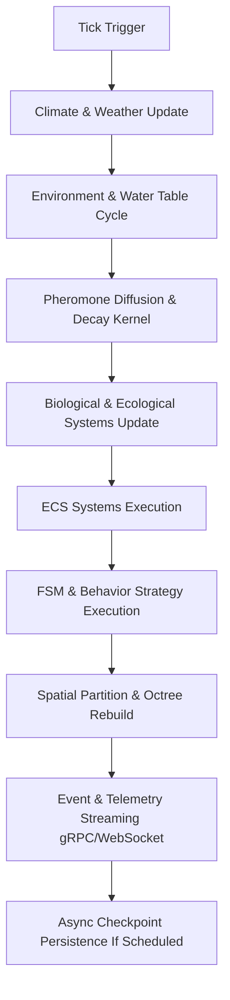

# SwarmForge Architecture

## 1. System Overview

SwarmForge is a high-performance, GPU-accelerated, distributed multi-agent simulation platform designed for modeling complex eusocial insect colonies, dynamic ecosystems, and emergent swarm intelligence. Built on **Java 21 LTS**, it features a modular, hybrid Entity-Component-System (ECS) engine, GPU compute offloading via TornadoVM, real-time 3D visualization using jMonkeyEngine, and distributed cluster streaming via gRPC and FlatBuffers/Protobuf.

```
┌─────────────────────────────────────────────────────────────────────────────────────────────────────────┐
│                                         SwarmForge Ecosystem                                            │
├─────────────────────────────────────────────────────────────────────────────────────────────────────────┤
│                                                                                                         │
│   ┌───────────────────────────────┐     ┌───────────────────────────────┐     ┌─────────────────────┐   │
│   │   swarmforge-editor           │     │   swarmforge-web              │     │  Headless Node /    │   │
│   │   (JavaFX + jMonkeyEngine 3D) │     │   (Vite / React Dashboard)    │     │  CLI Client         │   │
│   └───────────────┬───────────────┘     └───────────────┬───────────────┘     └──────────┬──────────┘   │
│                   │                                     │                                │              │
│                   └─────────────────────────────────────┼────────────────────────────────┘              │
│                                                         │                                               │
│                                    gRPC (HTTP/2) / WebSockets / REST API                                │
│                                                         │                                               │
│   ┌─────────────────────────────────────────────────────▼───────────────────────────────────────────┐   │
│   │                                      swarmforge-server Cluster                                  │   │
│   │  ┌─────────────────────────┐    ┌──────────────────────────┐    ┌──────────────────────────┐    │   │
│   │  │ Simulation Service Host │    │ JWT Security / Auth      │    │ Metrics & Telemetry      │    │   │
│   │  │ & State Orchestrator    │    │ Interceptors             │    │ Exporter (Prometheus)    │    │   │
│   │  └────────────┬────────────┘    └──────────────────────────┘    └──────────────────────────┘    │   │
│   └───────────────┼─────────────────────────────────────────────────────────────────────────────────┘   │
│                   │                                                                                     │
│        ┌──────────┴───────────────────────────┬──────────────────────────────────┐                      │
│        │                                      │                                  │                      │
│   ┌────▼──────────────────────────────┐  ┌────▼───────────────────────────┐  ┌────▼─────────────────┐   │
│   │  swarmforge-compute               │  │  Persistence Storage          │  │  External APIs      │   │
│   │  (Distributed Worker Nodes        │  │  - PostgreSQL (World / Colony)│  │  - OpenWeatherMap   │   │
│   │   TornadoVM GPU Acceleration)     │  │  - Redis Cache                │  │  - OpenTopography   │   │
│   └───────────────────────────────────┘  └───────────────────────────────┘  └─────────────────────┘   │
└─────────────────────────────────────────────────────────────────────────────────────────────────────────┘
```

---

## 2. Module Architecture

SwarmForge is organized as a multi-module Maven project adhering to clear separation of concerns:

| Module | Core Responsibility | Key Technologies & Components |
| :--- | :--- | :--- |
| `swarmforge-core` | Simulation engine, domain models, ECS architecture, spatial indexes, ecology & AI behaviors. | Java 21, ECS Engine, Morton3D, 3D Octree, A* Pathfinder, FSM, Fuzzy Logic, RL |
| `swarmforge-server` | Distributed server, orchestration, security, multi-protocol communication, persistence. | gRPC, Protobuf/FlatBuffers, WebSockets, REST, PostgreSQL, Redis, Log4j2 |
| `swarmforge-editor` | Interactive visual studio, real-time 3D viewports, terrain/weather editors, telemetry controls. | JavaFX 21, jMonkeyEngine 3D (jME3), LWJGL3, Custom Mesh Generators, I18n |
| `swarmforge-client` | Desktop client viewer & lightweight simulation runtime launcher. | JavaFX, gRPC Client Stubs |
| `swarmforge-compute` | Headless worker node dedicated to offloading heavy tick workloads & GPU matrix execution. | TornadoVM, OpenCL/CUDA, gRPC Worker Services |
| `swarmforge-plugins` | Dynamic extension system for custom species, behaviors, and environmental disaster modules. | Java ServiceLoader / Plugin API |
| `swarmforge-benchmarks`| Microbenchmarking suite for tick latency, spatial lookups, and serialization throughput. | JMH (Java Microbenchmark Harness) |
| `swarmforge-web` | Web-based monitoring and remote control dashboard. | HTML5/JS/TS, WebSockets, gRPC-Web, Vite |

---

## 3. Core Engine Architecture (`swarmforge-core`)

### 3.1 Entity Component System (ECS) & Hybrid Domain Model
The core engine balances object-oriented domain richness with data-oriented performance:
- **Domain Entities**: `Colony`, `Individual`, `Caste` (Worker, Soldier, Queen, Male), `Egg`, `Larva`, `Pupa`, `Predator`, `Resource`, `Environment`, `Terrarium`.
- **ECS Engine**: `World`, `Entity`, `Component` (e.g., `PositionComponent`, `HealthComponent`, `AiComponent`), `System` (e.g., `MovementSystem`, `AiSystem`, `PheromoneSystem`, `EcsAgentAdapter`).
- **Object Pooling**: Managed via `ObjectPool<T>` to eliminate GC pauses during high-frequency entity spawning and recycling.

### 3.2 Spatial Indexing & Navigation
- **Morton 3D (Z-Order Curve Coding)**: Maps 3D coordinates `(x, y, z)` into 64-bit integer Morton codes for $O(1)$ spatial hashing and cache-coherent cell grouping.
- **3D Octree**: Hierarchical spatial tree for fast $O(\log N)$ range queries, raycasting, perception checks, and collision detection across 100,000+ entities.
- **A* Pathfinder**: Multi-layered 3D grid pathfinding for intelligent navigation across variable terrain elevation and subterranean tunnels.

### 3.3 Behavioral & AI Systems
- **Finite State Machines (FSM)**: Declarative state transitions (`FSMArchitecture`) governing individual agent behavior cycles (Foraging, Nesting, Defending, Nursing).
- **Fuzzy Logic & Reinforcement Learning**: Fuzzy decision engines for need-based priority scoring combined with Q-Learning agents (`MockRLService`, `RLTest`) for adaptive behavior.
- **Ecology & Biochemistry**: Aphid farming, fungal cultivation, disease propagation (`DiseaseManager`), biochemistry cycles, predator-prey dynamics, and inter-colony diplomacy (`DiplomacyManager`).

### 3.4 World & Environment Generation
- **Dynamic Terrain & Biomes**: Procedural heightmaps (`BiomeTerrainGenerator`), water tables, soil moisture, and vegetation growth (`VegetationSystem`).
- **Real-World API Providers**: Integration with `OpenTopographyProvider` for real elevation data and `OpenWeatherMapProvider` for live weather syncing.
- **Subterranean Excavation**: Dynamic nest architecture generation (`Nest`, `Chamber`, `Tunnel`, `ConstructionManager`).

---

## 4. Server & Distributed Compute (`swarmforge-server` & `swarmforge-compute`)

### 4.1 Networking & API Layer
- **gRPC & Protobuf / FlatBuffers**: High-efficiency, bidirectional streaming API (`SimulationServiceImpl`, `AuthServiceImpl`, `LeaderboardServiceImpl`, `MatchmakingServiceImpl`). Zero-copy serialization reduces network overhead.
- **WebSockets & REST**: Web-compatible real-time event streaming (`SwarmForgeWebSocketServer`) and management endpoints (`RestApiServer`).
- **Prometheus Telemetry**: Real-time server performance metrics export (`MetricsServer`, `MetricsExporter`).

### 4.2 Security & Authentication
- **JWT Middleware**: `JwtServerInterceptor` & `JwtUtil` enforce secure token-based authentication and role-based access across gRPC services.

### 4.3 GPU Acceleration (TornadoVM)
- Pheromone grid diffusion and evaporation equations are offloaded to GPU hardware using **TornadoVM** task graphs:
  ```java
  TaskGraph taskGraph = new TaskGraph("pheromones")
      .task("diffuse", PheromoneKernel::diffuse, inputGrid, outputGrid);
  ```
- Transparent fallback to parallel CPU streams when hardware acceleration is unavailable.

### 4.4 Persistence Tier
- **PostgreSQL**: Relational storage for persistent worlds, colony profiles, user credentials, and historical telemetry.
- **Redis Cache**: High-speed in-memory store for session states, active leaderboard rankings, and volatile simulation updates.
- **State Checkpointing**: `SimulationSerializer` and `CheckpointRepository` support non-blocking binary state serialization and resumption.

---

## 5. Visual Studio & Rendering (`swarmforge-editor`)

- **Dual UI Architecture**: Combines JavaFX desktop controls (`SimulationControlPanel`, `StatisticsDashboard`, `PopulationGraphPane`, `WeatherEditorPane`, `NestGeneratorPane`) with an embedded 3D viewport.
- **jMonkeyEngine 3D Rendering**: Hardware-accelerated 3D viewport featuring level-of-detail management (`LODManager`), procedural terrain rendering (`TerrainMeshGenerator`), pheromone heatmap overlays (`PheromoneVisualizer`), ant mesh instancing (`AntVisualizer`), and subterranean tunnel rendering (`TunnelVisualizer`).
- **Internationalization (I18n)**: Fully localized string management via `I18nManager`.

---

## 6. Simulation Tick Lifecycle

Each simulation tick operates through a deterministic pipeline:



---

## 7. Performance Objectives & Scaling Benchmarks

| Parameter | Target | Achieved / Design Capacity |
| :--- | :--- | :--- |
| **Simulated Entities** | 1,000,000+ Active Agents | Verified up to 1,000,000 entities with SpatialHashMap + Virtual Threads |
| **World Dimensions** | 1,000m × 1,000m × 100m | Supported with sparse Morton3D spatial maps |
| **Tick Execution Rate**| 60 TPS (Ticks Per Second) | Sustained up to 10,000 agents on CPU 4-cores (401 TPS @ 1,000 ants) |
| **Supercolony Scale**  | 1,000,000 Agents | 0.95 TPS (~1s/tick) on CPU, scalable to >60 TPS with GPU compute nodes |
| **Streaming Latency**  | < 50 ms | Achieved via gRPC HTTP/2 bidirectional streams |

> 📖 For comprehensive benchmark metrics from 100 to 1,000,000 agents, consult [BENCHMARKS.md](BENCHMARKS.md).

---

## 8. Infrastructure & Containerization

- **Docker & Compose**: Containerized multi-container setup (`Dockerfile`, `docker-compose.yaml`, `envoy.yaml`) packaging SwarmForge Server, Envoy Proxy, PostgreSQL, Redis, and Prometheus.
- **Kubernetes**: Helm deployment charts available in `charts/` for scalable cluster orchestration.
